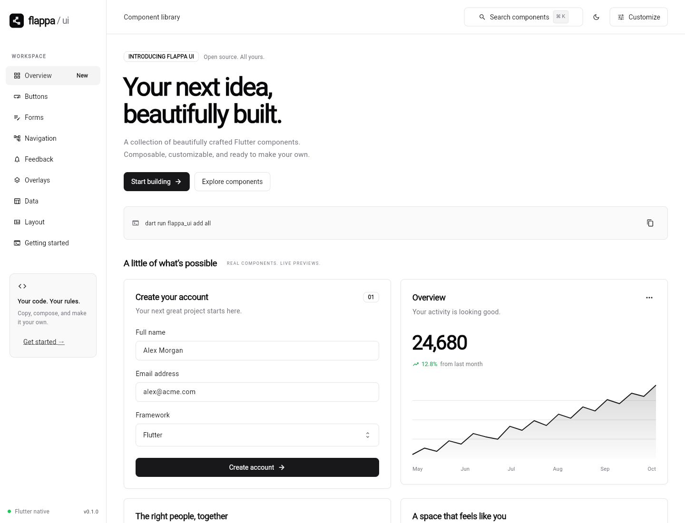

# Flappa UI

A Flutter UI library inspired by shadcn/ui: neutral colors, restrained borders, composable widgets, light and dark themes, and source you can own. No third-party runtime dependencies.

**71 component widgets, six overlay helpers, a source-copy CLI, and an interactive showcase.**



## Run the site

Requires Flutter **3.38+** and Dart **3.10+**. Developed and verified with Flutter 3.47.5 / Dart 3.13.4.

```sh
cd example
flutter pub get
flutter run -d chrome
```

The example also contains Android and iOS runners. Pick a connected device with `flutter devices`, then `flutter run -d <device-id>`. Native binaries have not been built as part of this workspace's verification.

The app opens on a landing page with links to the component explorer and visual screen playground. Browse `/#/components` or build at `/#/playground`.

Explore forms, navigation, feedback, overlays, data, layout, building blocks, messages, questionnaires, and charts. Use **Customize** for accent colors and corner radius, the moon/sun button for dark mode, and **⌘K / Ctrl+K** to search. Component examples have expandable source code and copy buttons. Account and invitation actions are local demonstrations; they do not call a backend or send messages.

To test components on a real mobile runtime, open an Android emulator or iOS Simulator and run `flutter run -t lib/main_components.dart -d <device-id>` from `example/`. Use `flutter devices` to find the device ID, or choose **Flappa UI components (emulator or device)** in VS Code. This opens the component gallery directly, with native input, scrolling, and dialogs.

## Screen playground

Compose single-column screens from 14 block types, edit their properties, reorder layers, and tune spacing and theme. Start with Welcome, Settings, Dashboard, or a blank screen. Undo/redo, browser-local drafts, and JSON import/export keep your work editable. Export downloads a runnable Flutter `main.dart` using Flappa UI; playground input values are temporary and button actions are local demos. See the [site guide](example/README.md).

## Use as a package

This is a local package, not a published pub.dev release. In your Flutter application's `pubspec.yaml`:

```yaml
dependencies:
  flutter:
    sdk: flutter
  flappa_ui:
    path: /absolute/path/to/flappa

flutter:
  uses-material-design: true
```

Run `flutter pub get`, then:

```dart
import 'package:flutter/material.dart';
import 'package:flappa_ui/flappa_ui.dart';

void main() => runApp(
  FlappaApp(
    themeMode: ThemeMode.system,
    home: Scaffold(
      body: Center(
        child: FButton(
          onPressed: () {},
          leading: const Icon(Icons.add),
          child: const Text('Create project'),
        ),
      ),
    ),
  ),
);
```

Already have an app or router? Install the theme directly:

```dart
MaterialApp(
  theme: FThemeData().toThemeData(),
  darkTheme: FThemeData(brightness: Brightness.dark).toThemeData(),
  themeMode: ThemeMode.system,
  home: const MyHomePage(),
);
```

`MaterialApp.router` works the same way. Use it directly for custom routing, localization delegates, navigator keys, or app builders.

## Copy components into your project

After adding the local dependency, run these commands **from your application's root**:

```sh
dart run flappa_ui init
dart run flappa_ui list
dart run flappa_ui add button forms
# Or copy everything:
dart run flappa_ui add all
```

The installer writes to `lib/ui` by default. Import `ui/flappa_ui.dart` instead of the package. Copied components depend only on Flutter, so you can remove the `flappa_ui` dependency after copying.

```sh
dart run flappa_ui add overlays --path lib/design_system
dart run flappa_ui add button --force  # explicitly replace local changes
```

- Groups include their dependencies; overlays include forms and buttons.
- The installer creates semantic theme tokens and a barrel export.
- Component and export collisions are checked before any writes. Modified files require `--force`.
- Existing themes are preserved when adding components, including with `add --force`. Use `init --force` to reset the copied theme.
- Keep `.flappa.json` with the copied source; it tracks installed groups.
- Copy granularity is a component **group**, not one widget at a time.

## Component catalog

| Group | Components |
| --- | --- |
| `button` | `FButton` (primary, secondary, outline, ghost, destructive, link; four sizes; loading), `FToggle`, `FToggleGroup` |
| `display` | `FCard`, `FBadge`, `FAlert`, `FAvatar`, `FAvatarGroup`, `FSeparator`, `FProgress`, `FSpinner`, `FSkeleton`, `FTooltip`, `FKbd`, `FEmpty`, `FScrollArea` |
| `forms` | `FField`, `FInput`, `FTextarea`, `FCheckbox`, `FSwitch`, `FRadioGroup`, `FSelect`, `FCombobox`, `FSlider`, `FRangeSlider`, `FInputOTP`, `FDatePicker`, `FDateRangePicker`, `FCalendar`, `FNativeSelect` |
| `navigation` | `FTabs`, `FAccordion`, `FCollapsible`, `FBreadcrumb`, `FPagination`, `FNavigationMenu`, `FSidebar` |
| `overlays` | `FDialog`, `FDropdownMenu`, `FPopover`, `FCommand`, `FContextMenu`, `FMenubar`, `FHoverCard`, `FDrawer`; `showFDialog`, `showFConfirm`, `showFSheet`, `showFToast`, `showFCommand`, `showFDrawer` |
| `advanced` | `FDataTable`, `FChart`, `FCarousel`, `FResizable` |
| `code_block` | `FCodeBlock` (Dart, YAML, shell, JSON, plain text; selection, line numbers, scrolling, clipboard feedback) |
| `composition` | `FButtonGroup`, `FInputGroup`, `FLabel`, `FFieldSet`, `FItem`, `FItemGroup`, `FAspectRatio`, `FTypography`, `FMarker`, `FDirection` |
| `messaging` | `FAttachment`, `FBubble`, `FMessage`, `FMessageScroller` |
| `questionnaire` | `FQuestionnaire`, `FChoiceCard`; question, choice, and answer models |
| `charts` | `FBarChart`, `FDonutChart`, `FChartLegend`; `FChartDatum` |
| `table` | `FTable` with headers, striped rows, numeric alignment, footer, and caption |

Use Flutter's `Form`, `GridView`, `Row`, `Column`, and `Wrap` for layout and validation. `showFSheet` supports fixed side/bottom panels; `showFDrawer` provides a draggable bottom panel with coordinated scrolling.

This is an independent Flutter implementation, not an official shadcn project, a React API port, or a claim of complete feature parity with every upstream component. The catalog above is the implemented scope. Charts cover single-series line/area plots, categorical bars, and donut charts. Stacked/multi-series plots, time axes, and application-specific data loading remain outside this version.

## Theme tokens

```dart
final theme = FThemeData(
  radius: 10,
  fontFamily: 'YourBundledFont',
  colors: FColors.zinc().copyWith(
    primary: const Color(0xFF2563EB),
    primaryForeground: Colors.white,
    ring: const Color(0xFF2563EB),
  ),
);
```

Read tokens with `FTheme.of(context)`. Available colors are `background`, `foreground`, `card`, `primary`, `primaryForeground`, `secondary`, `secondaryForeground`, `muted`, `mutedForeground`, `accent`, `accentForeground`, `destructive`, `destructiveForeground`, `border`, and `ring`.

`FThemeData` is a `ThemeExtension`, supports `copyWith` and animated interpolation, and themes native inputs, radio/checkbox/switch controls, sliders, dialogs, menus, progress, and tooltips. Supply separate light/dark token sets when customizing. Fonts must be bundled and declared by the host application.

## Code blocks

```dart
const FCodeBlock(
  code: "FButton(onPressed: save, child: const Text('Save'))",
  language: FCodeLanguage.dart,
  filename: 'save_button.dart',
  maxHeight: 360,
  showLineNumbers: true,
)
```

The highlighter provides display-oriented token coloring for Dart, YAML, shell, and JSON; use `FCodeLanguage.plain` for other source. It preserves original whitespace, supports selection across lines, and copies the exact source without the line-number gutter. Long lines scroll horizontally and tall snippets scroll within `maxHeight`. Colors adapt to light/dark themes. Copy success/failure appears in the toolbar.

Set `fontFamily` to a monospace font bundled by your app. The showcase bundles [JetBrains Mono](https://github.com/JetBrains/JetBrainsMono) and its [OFL license](example/assets/fonts/OFL.txt); the component defaults to `monospace`. Copy this component with `dart run flappa_ui add code_block`.

## Forms and state

Most interactive widgets are controlled: keep the value in your state and update it in `onChanged`.

```dart
FField(
  label: 'Email',
  required: true,
  description: 'We will only send important updates.',
  child: FInput(
    semanticLabel: 'Email',
    controller: emailController,
    keyboardType: TextInputType.emailAddress,
    autofillHints: const [AutofillHints.email],
    validator: (value) =>
        value == null || value.trim().isEmpty ? 'Email is required' : null,
  ),
)
```

`FInput`, `FTextarea`, and `FNativeSelect` participate in Flutter `Form` validation. `FNativeSelect` owns its selected value, supports `initialValue`, `validator`, `onSaved`, and `FormState.reset()`. `FSelect` exposes `errorText`; wrap it in a native `FormField<T>` if it needs to participate in a form. Supply either an input controller or an initial value. Dispose controllers and focus nodes you create.

`FAccordion`, `FCarousel`, and `FResizable` own their internal state and expose change callbacks. Use `initiallyExpanded` or `initialRatio` for initialization, or a new widget key to reset them. `FTabs` mounts the selected panel only: keep durable form state in the parent. `FPagination` is one-based. Progress values use 0–1; sliders default to 0–100. `FCarousel` needs at least one child; charts need at least two finite values.

## Overlays

```dart
final confirmed = await showFConfirm(
  context: context,
  title: 'Delete project?',
  description: 'This action cannot be undone.',
  confirmLabel: 'Delete project',
  destructive: true,
);
if (confirmed) {
  // Perform the operation in your application.
}
```

Dialog builders get the dialog route's context. Use it with `Navigator.pop(context, result)`. Overlay helpers return results so business logic remains in your application. Toasts require a `Scaffold` and `ScaffoldMessenger` ancestor, normally supplied by `MaterialApp` and your screen.

## Composition and messaging

```dart
FInputGroup(
  leading: const Icon(Icons.search),
  trailing: FButton(onPressed: search, child: const Text('Go')),
  child: FInput(controller: query, placeholder: 'Search projects'),
)
```

Input groups share a focus border across their controls and support leading/trailing content, headers, footers, errors, and disabled interaction. Set `enabled: false` on an inner input as well when its native disabled styling is needed. `FFieldSet` groups related fields; `FLabel` can focus an associated `FocusNode` when tapped. Give icon-only grouped actions a tooltip. `FButtonGroup` supports horizontal and vertical layouts and scrolls horizontally when needed.

`FItem` supports plain, outlined, and muted variants, leading/trailing content, a footer, and optional activation. `FItemGroup` adds consistent spacing or dividers. `FTypography` provides headings, paragraphs, lead text, small/muted text, quotes, and inline code. `FAspectRatio` adds themed clipping to fixed-ratio content.

```dart
SizedBox(
  height: 320,
  child: FMessageScroller(
    children: const [
      FMessage(author: 'Sofia', child: Text('Hello!')),
      FMessage(outgoing: true, child: Text('Hey there.')),
    ],
  ),
)
```

`FMessageScroller` requires a bounded height. It follows appended or resized content while the reader is near the end, preserves their position when they scroll away, and offers a Jump to latest action. Give messages stable keys and rebuild the scroller when content changes. `FMessage` composes author, timestamp, avatar, bubble, and actions; `FBubble` can be used independently. `FAttachment` displays file metadata, optional previews, upload progress/errors, and separate open/remove callbacks. Uploading and sending are owned by your application.

```dart
showFDrawer<void>(
  context: context,
  builder: (context, controller) => FDrawer(
    title: 'Recent activity',
    controller: controller,
    child: activityList,
  ),
);
```

Pass the provided controller into `FDrawer` so scrolling expands the drawer before scrolling its content. Initial/minimum/maximum sizes are fractions of available height. Drawer helpers return values passed to `Navigator.pop`.

Copy the new groups with `dart run flappa_ui add composition messaging forms overlays`.

## Questionnaires and data displays

```dart
FQuestionnaire(
  questions: const [
    FQuestion(
      id: 'project',
      title: 'What are you building?',
      allowText: true,
      choices: [
        FQuestionChoice(value: 'app', label: 'A mobile app'),
        FQuestionChoice(value: 'site', label: 'A website'),
      ],
    ),
    FQuestion(
      id: 'priorities',
      title: 'What matters most?',
      required: false,
      multiple: true,
      choices: [
        FQuestionChoice(value: 'speed', label: 'Speed'),
        FQuestionChoice(value: 'accessibility', label: 'Accessibility'),
      ],
    ),
  ],
  onSubmitted: (answers) async => saveAnswers(answers),
)
```

Questionnaires own navigation and answers. Single-choice questions treat typed text as an alternative to the fixed choices; multiple-choice questions retain both. Required questions and custom validators gate advancement. Optional questions offer explicit Skip, which clears that answer. Going back preserves responses. Submission accepts synchronous or asynchronous callbacks, disables duplicate submission, and preserves answers for retry after an exception. Answers delivered to callbacks are immutable snapshots keyed by question ID. Keep question IDs unique and the question collection stable during a session; use a new widget key to start a different questionnaire. `initialAnswers` is read at initialization. Persistence belongs to your application.

`FChoiceCard` is also usable independently, with selected/disabled states, single/multiple indicators, `focusNode`, and `autofocus`. `FMarker` supports inline, bordered, and separator variants; opt into live announcements with `live: true`. Use `FDirection` to set the ambient LTR/RTL direction for a subtree.

```dart
const traffic = [
  FChartDatum(label: 'Direct', value: 420, color: Color(0xFF2563EB)),
  FChartDatum(label: 'Search', value: 310, color: Color(0xFF14B8A6)),
];

FDonutChart(data: traffic, selectedIndex: selected, onSelected: selectSegment);
FChartLegend(data: traffic, selectedIndex: selected, onSelected: selectSegment);
```

Charts require finite values and bounded width. Bar charts support negative values, a zero baseline, hover tooltips, keyboard activation, and horizontal scrolling for many categories. Donuts require non-negative values and a finite sum, offer segment hit testing, and render an empty ring for zero totals. `selectedIndex` is controlled by the host; use `null` to clear selection. Pair an interactive donut with `FChartLegend` for keyboard selection. Both charts expose values to screen readers. Custom formatters are available for bar tooltips and legend values.

`FTable` is a lightweight display table; use `FDataTable` when you need sorting or selection. Every row and optional footer must have the same number of cells as the non-empty header. Tables scroll horizontally on narrow screens.

Copy these groups with `dart run flappa_ui add questionnaire charts table composition`.

## Accessibility and layout

- Native controls provide focus, keyboard activation, selection, disabled states, and editing behavior. Supply tooltips or semantic labels for icon-only controls and inputs.
- Tabs support arrow keys, Home, and End; comboboxes support native autocomplete keyboard selection; commands support filtering, Up/Down, and Enter.
- Context menus support right-click, long-press, and Shift+F10; menubars use Flutter’s keyboard navigation. Hover cards support hover, focus, and tap.
- Dialogs use Flutter route focus behavior; confirmation dialogs initially focus Cancel. Menus and popovers use native overlay primitives.
- Skeletons, carousel transitions, and sheets respect reduced-motion settings. Indeterminate progress remains animated.
- `FResizable` supports pointer dragging, arrow keys, semantic increase/decrease actions, ratio bounds, and RTL direction. Give it bounded dimensions along its axis.
- Cards, fields, and tables require a finite available width. A sidebar needs bounded height. Scroll areas should be placed inside a constrained height/width.
- Table rows are supplied by your app. Sorting callbacks should reorder your data; use `FPagination` to implement paging. Tables scroll horizontally on narrow screens.
- The basic line/area chart exposes a screen-reader summary. Pair it with a table when every data point must be accessible. The original `FChart` does not provide axes, tooltips, or multiple series; use `FBarChart` for categorical tooltips and selection.
- Verify text scaling, contrast after customization, and screen-reader behavior in your final app. The showcase is tested at 390px and 1440px widths.

## Development

```sh
flutter pub get
flutter analyze
flutter test
cd example
flutter test
flutter build web --release
```

CI checks formatting, analysis, package/CLI tests, showcase tests, and the web build. To generate API docs, run `dart doc` at the package root.

```text
lib/flappa_ui.dart           Public package exports
lib/src/theme/theme.dart    Semantic colors and Flutter theme
lib/src/components/         Twelve component groups
bin/flappa_ui.dart          Source-copy installer
example/                    Responsive interactive showcase
screenshots/                Website and simulator screenshots
```

Design references: [shadcn/ui theming](https://ui.shadcn.com/docs/theming), [Flutter themes](https://docs.flutter.dev/cookbook/design/themes), and [ThemeExtension](https://api.flutter.dev/flutter/material/ThemeExtension-class.html).

MIT licensed. See [LICENSE](LICENSE).
